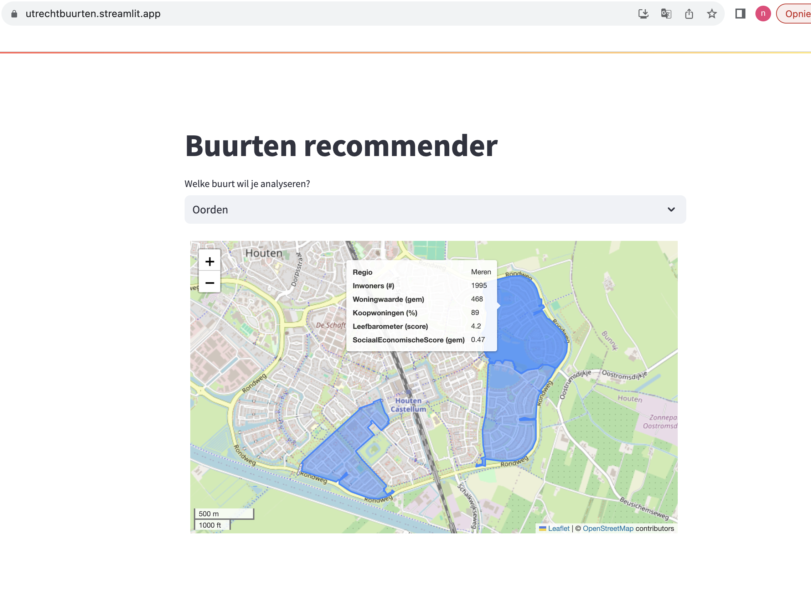

### Introduction
Still trying to look for a house and somethimes we pass a very nice neighborhood. So the question I tried to answer was, if we like specific buurt in our province; can we find others that are look a likes?  
This way creating a recommendersytem for buurten based on specific demographics of the place.

#### Starting date
Dec 1, 2022

#### Context
To be able to analyse several aspects within 'buurten', I collected data from various sources:
* Open CBS data: https://www.cbs.nl/nl-nl/achtergrond/2022/14/statusscore-per-wijk-en-buurt-o-b-v-welvaart-opleidingsniveau-en-arbeid
* Leefbarometer score: https://www.leefbaarometer.nl/tabel.php?indicator=Leefbaarheidssituatie&schaal=Buurt&gemeente=GM0344
* Geluidsblootstelling: https://statline.rivm.nl/portal.html?_la=nl&_catalog=RIVM&tableId=50066NED&_theme=96
* Woningvoorraad: https://opendata.cbs.nl/statline/#/CBS/nl/dataset/83704NED/table
* Tevredenheidscores: https://opendata.cbs.nl/statline/#/CBS/en/dataset/84571ENG/table

**Input features eventually used:**
>    ['aantal_inwoners', 'aantal_inwoners_tussen_25_44_percentage',
>    'aantal_huishoudens_met_kinderen_percentage', 'gemiddelde_huishoudensgrootte', 'woningvoorraad',
>    'gemiddelde_woningwaarde', 'meergezinswoning_percentage', 'bewoond_percentage', 'koopwoning_percentage',
>    'bouwjaar_vanaf_2000_percentage', 'afstand_tot_ziekenhuis_km', 'afstand_tot_grote_supermarkt_km', 'afstand_tot_cafe_km',
>    'afstand_tot_kinderdagverblijf_km', 'afstand_tot_buitenschoolseopvang_km', 'afstand_tot_openbaar_groen_km',
>    'afstand_tot_park_of_plantsoen_km', 'afstand_tot_bos_km','afstand_tot_hoofdverkeersweg_km', 'afstand_tot_treinstation_km',
>    'AfstandTotSemiOpenbaarGroenTotaal_83', 'leefbarometer_score', 'leefbarometer_fysieke_omgeving', 'leefbarometer_fysieke_overlast',
>    'leefbarometer_sociale_samenhang', 'leefbarometer_voorzieningen', 'aardgasverbruik_m3_gemiddeld', 
>    'elektriciteitsverbruik_kwh_gemiddeld', 'social_economische_score_gemiddeld', 'geluid_van_treinverkeer', 
>    'geluid_van_weg']

#### Results
For each buurt we recommend 3 neighborhoods that are look a likes (determined by the cosine similarity score) based on the input variables above:

    

To visualize relevant info, I decided to select 5 variables that are demonstrated per buurt.
However, note that the anlaysis is done on all the variables and not just these 5.

#### Application
Two options:
1. demo streamlit app via their cloud: https://utrechtbuurten.streamlit.app/
2. Run or deploy docker app with fastapi backend and streamlit frontend (docker compose up).

#### Tech and Tools
recommender systemts, streamlit, fastapi